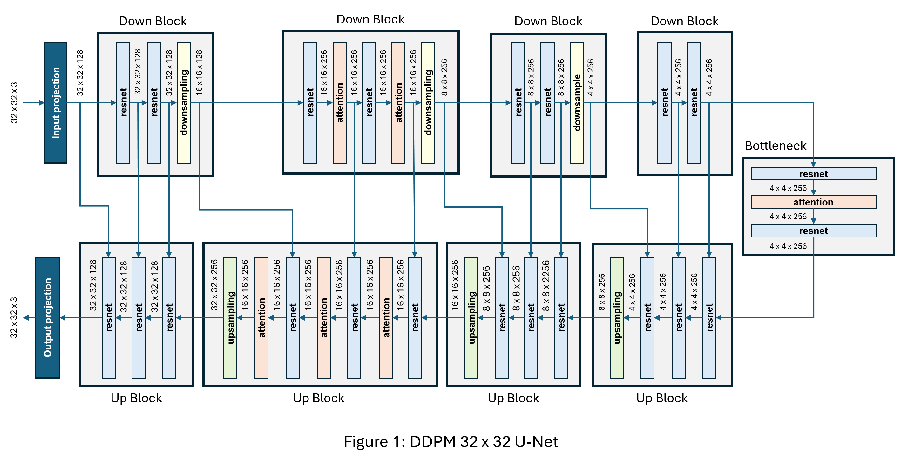
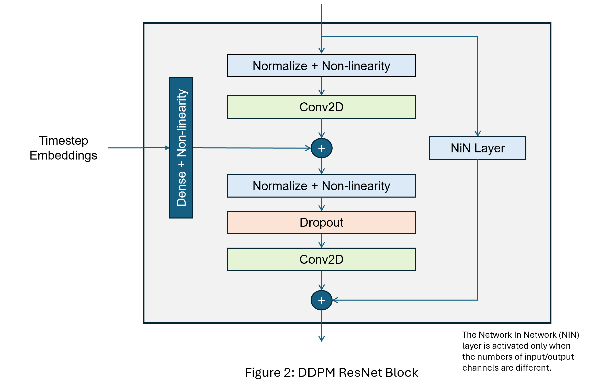
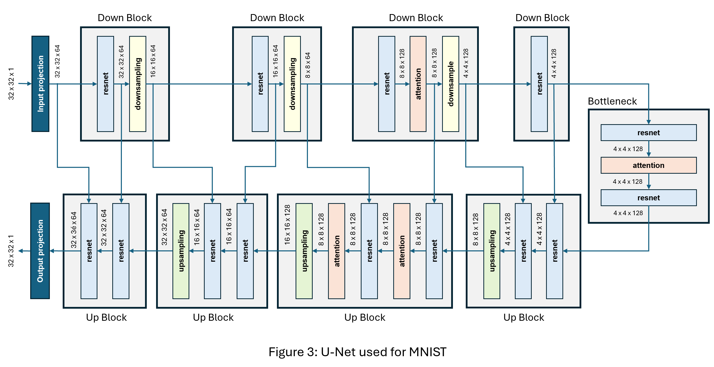
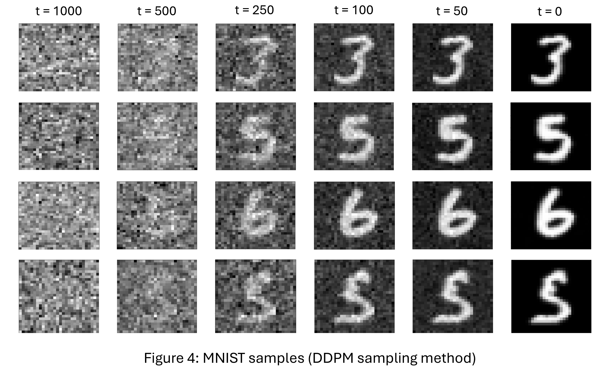
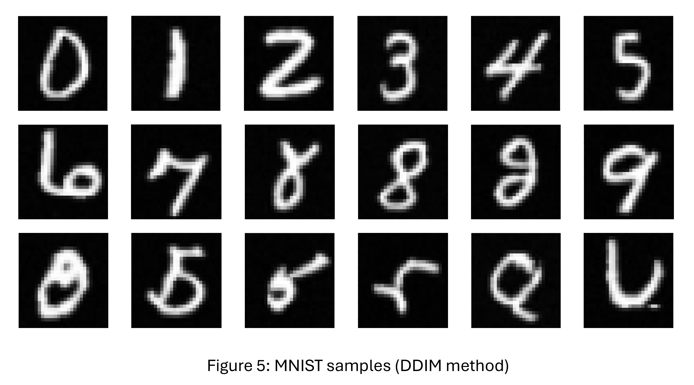
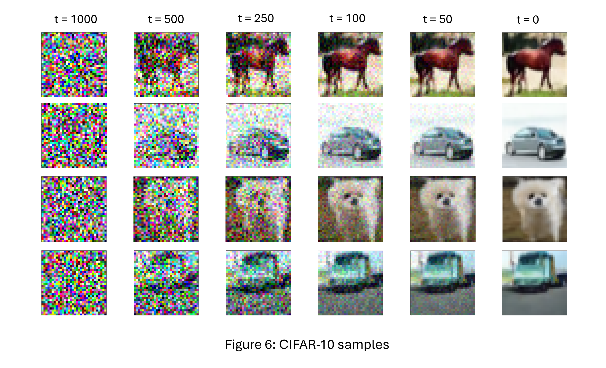

# Diffusion model from scratch using research papers

## 1. Background

Diffusion models have become the state-of-the-art approach for generating images, videos, and music. They power popular tools such as DALL-E (OpenAI), Stable Diffusion (Stability AI), Firefly (Adobe), Diffusers Library (Hugging Face), and Midjourney (Midjourney, Inc). They have also found applications in many other domains, including 3D modelling, medical imaging, drug discovery, molecular design, and more.

Diffusion models first appeared in a 2015 paper titled "Deep unsupervised learning using Nonequilibrium Thermodynamics" by Jascha Sohl-Dickstein et al. While the paper was theoretically significant, results were limited to toy datasets. It received little attention at the time, as research was largely focused on GANs.

In 2020, Jonathan Ho et al. published a paper titled "Denoising Diffusion Probabilistic Models" (DDPMs). The main contribution of this paper was to transform the ideas from the 2015 work into a state-of-the-art technique for image generation. The paper quickly gained traction and is now one of the most cited works in the field, with 10,000+ citations as of 2025.

Because it required many iterative steps, the sampling method used in the DDPM paper was significantly slower than GAN-based models. However, shortly after the DDPM paper came out, Jiaming Song et al. published "Denoising Diffusion Implicit Models" (DDIMs), which introduced a much faster sampling technique.

Subsequent papers introduced various improvements that ultimately enabled diffusion models to produce higher-quality images than GANs, while being significantly easier to train.

## 2. Project goal

The goal of this project was to recreate the DDPM model from the 2020 paper by Jonathan Ho et al., train it, and generate samples using both the DDPM and DDIM methods.

Jonathan Ho posted on Github the TensorFlow code they used for their research, at this URL provided in the paper:

[JohnathanHo/DDPM](https://github.com/hojonathanho/diffusion)

Many PyTorch implementations of DDPM are now available on GitHub, including:

- [lucidrains/denoising-diffusion-pytorch](https://github.com/lucidrains/denoising-diffusion-pytorch?utm_source=chatgpt.com)

- [openai/improved-diffusion](https://github.com/openai/improved-diffusion?utm_source=chatgpt.com)

- [mattroz/diffusion-ddpm](https://github.com/mattroz/diffusion-ddpm?utm_source=chatgpt.com)

- [cloneofsimo/minDiffusion](https://github.com/cloneofsimo/minDiffusion?utm_source=chatgpt.com)

Because my goal was to gain a deep understanding of DDPM models, I only relied on the 2020 DDPM and DDIM papers, and some of the works they reference. I only looked at Ho's code on GitHub when important implementation details were not specified in the paper.

From the start, I knew I wouldn’t have enough GPU resources to tackle the CelebA and LSUN datasets, so I decided to focus on CIFAR-10. However, as the project progressed, I realized I couldn’t train the same U-Net as in Ho’s code. Therefore, I began with the MNIST dataset. Then, I worked on CIFAR-10 using a smaller version of Ho’s U-Net, although I expected more modest results.

## 3. Source code and Python packages

All my code is in TensorFlow 2. Custom Keras layers and models are used for the U-Net and diffusion models.

The code is in the *./src* directory and is organized as shown below.

```
   src
    |     
    ├── u_net.py                   # U-Net model
    |
    ├── u_net_debug.py             # Same as u_net.py with prints and shape assertions
    |
    ├── train.py                   # Diffusion model training script
    |
    ├── sample.py                  # Sampling script using DDPM and DDIM methods
    |
    └── utils.py                   # Utilities (model summary, checkpoint saving callback)
```

See file *requirements.txt* for the list of Python packages I used.

## 4. Information missing in the DDPM paper

The DDPM paper describes in great detail the theory underlying DDPM models. It also provides training and sampling algorithms, which are straightforward to implement.

However, the information provided about the U-Net used to predict noise in the images is largely limited to the following paragraph:

```
B. Experimental details

Our neural network architecture follows the backbone of PixelCNN++ [52], which is a U-Net [48] 
based on a Wide ResNet [72]. We replaced weight normalization [49] with group normalization [66]
to make the implementation simpler. Our 32 x 32 models use four feature map resolutions 
(32 x 32 to 4 x 4), and our 256 x 256 models use six. All models have two convolutional residual
blocks per resolution level and self-attention blocks at the 16 x 16 resolution between 
the convolutional blocks [6]. Diffusion time t is specified by adding the Transformer sinusoidal
position embedding [60] into each residual block.
```

This description is not sufficient to fully reproduce the U-Net architecture used in the paper. Therefore, I had to reverse-engineer Ho's code on Github to obtain the missing implementation details.


## 5. U-Net model architecture

In Ho's code on Github, the U-Net used for the 32 x 32 images of the CIFAR-10 dataset is implemented as shown in Figure 1. The model has parameters to configure it for the 256 x 256 images of the CelebA and LSUN datasets.



The model follows the "classic" U-Net architecture:

- U-shaped architecture with a contracting path (encoder) and an expanding path (decoder)

- Skip connections that concatenate features from the contracting path to the corresponding layers in the expanding path, allowing the network to combine low-level and high-level features

Figure 2 shows the structure of the ResNet block as it is implemented in Ho's code.



The residual block was clearly inspired from Wide ResNet and PixelCNN++, as mentioned in the paper, and has the following key features:

- The residual connection adds the block’s input to its output after the block’s transformations. If the block input and output have the same number of channels, it is a straight connection. If they are different, a Network-in-Network (1 x 1 convolution) layer is inserted in the connection to make the shapes compatible for addition.

- Group normalization is done *before* convolution (pre-normalization).

- The timestep position embedding is passed through an MLP and added to the output of the first convolution. This allows the model to be aware of the current step in the diffusion process.

- Activations are SiLU (Swish) activations.

- A dropout layer is inserted between the normalization and convolution layers of the second sub-block.

Ho's code is in TensorFlow 1, which is now outdated. I did not try to run it. Instead, I wrote a state-of-the-art TensorFlow 2 model from scratch, using custom Keras layers (*u-net.py*). I also created a version of the model that prints tensor shapes and includes assertions to check them (*u_net_debug.py*), which was quite useful to debug my model and make sure it aligned with Ho's code.

In appendix *B. Experimental Details*, the authors mention:
```
Our CIFAR10 model has 35.7 million parameters, and our LSUN and CelebA-HQ models have 114 million
parameters. We also trained a larger variant of the LSUN Bedroom model with approximately 
256 million parameters by increasing filter count.
```

In the CIFAR-10 configuration (Figure 1), my U-Net model has 35.9M parameters. I was not able to explain the discrepancy with the 35.7M number given in the paper. I manually counted the parameters of the TensorFlow 1 model posted on Github and it has 35.9M, like my model.

## 6. MNIST Dataset

### 6.1 U-Net

The U-Net I used for the MNIST dataset is shown in Figure 3.



This model has 4.9M parameters, which is much smaller than Ho's CIFAR-10 model with its 35.9M parameters.

I made the following changes to the U-Net in Ho's code:

- Input images padded from 28 x 28 to 32 x 32 to have 4 resolution sizes
- Number of base channels (channels that the input convolution outputs) reduced from 128 to 64
- Only 1 ResNet block per up/down stage instead of 2
- Attention at the 8 x 8 resolution instead of 16 x 16
- Output images cropped from 32 x 32 to the original 28 x 28 size

### 6.2 Training setup

For training, I used the loss function described in section "*3.4 Simplified training objective*" of the DDPM paper, which is a simplified expression of the ELBO.

I used the training setup that is described in "*Appendix B: Experimental Details*":

- Timesteps: 1000
- Dropout rate: 0.1
- Optimizer: Adam with learning rate 2e-4
- Batch size: 128
- EMA decay factor: 0.9999

DDPM used a linear beta schedule. Instead, I used the cosine schedule introduced by Nichol & Dhariwal in 2021. This type of schedule was shown to improve results in many settings as it avoids destroying image information too quickly at the beginning of the forward process, as observed with linear schedules.

I trained the model for 100 epochs.

### 6.3 Sampling

Examples of samples obtained with the DDPM sampling method are shown in Figure 4. The images are shown at different time steps of the reverse process. The quality of the generated images is quite good, and so is diversity.



Examples of samples obtained with the DDIM sampling method are shown in Figure 5. Only 50 steps were used to obtain these images, using a completely deterministic method. Image quality and diversity are quite good.



On Google Colab using a T4 GPU, generating a batch of 128 images takes 4:45min wall-clock with the DDPM sampling method, compared to only 16sec with the DDIM method.

## 7. CIFAR-10 dataset

### 7.1 U-Net

For CIFAR-10, I used the same U-Net as in Ho's code (Figure 1), except that I reduced the number of ResNet blocks per up/down stage from 2 to 1.

With this setup, the network has 24.5M parameters versus 35.9M for Ho's network.

### 7.2 Training setup

I used the same training setup as for the MNIST dataset.

I added random flips to increase image diversity, as mentioned in appendix "*B. Experimental details*" of the DDPM paper:

```
We used random horizontal flips during training for CIFAR10; we tried training both with 
and without flips, and found flips to improve sample quality slightly.
```

Due to limited GPU resources, I could only train the model for 120 epochs.

### 7.3 Sampling

Only about one out of ten of the generated images had acceptable quality. Diversity was fine, although cars and trucks were slightly over-represented. Clearly, better results could have been obtained with a U-Net of the same size as in Ho's code, and more training epochs.

Examples of quality images I could obtain are shown in Figure 6.




## 8. Conclusion

This concludes my diffusion model from research papers project.

I obtained great results with the MNIST dataset and despite GPU limitations, I was able to generate some quality images with the CIFAR-10 dataset.

It was absolutely fascinating to see images emerge from pure noise!
