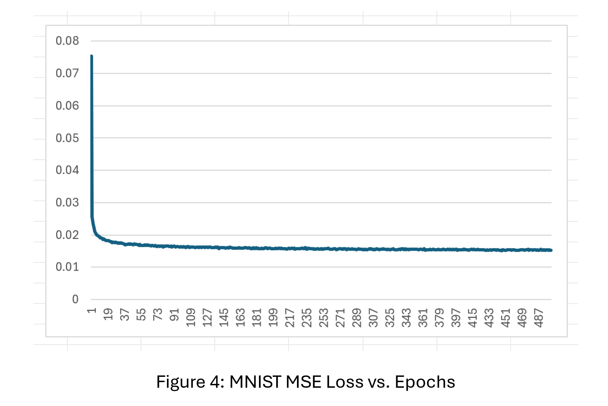
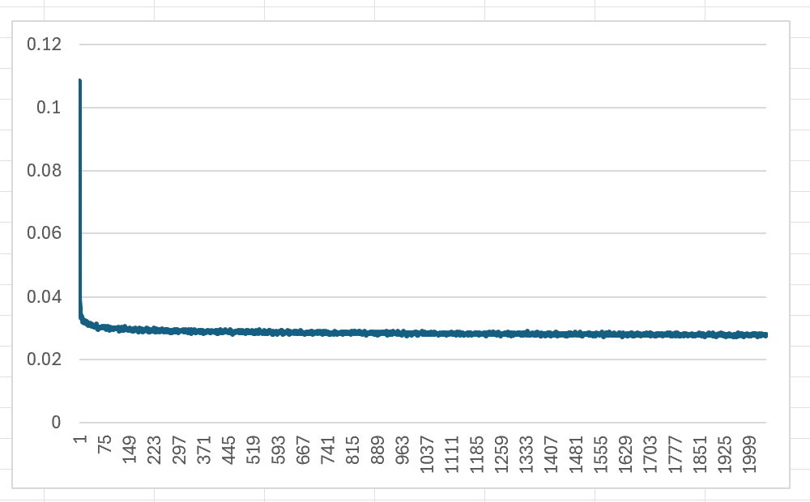

# Diffusion model from scratch using research papers

"What I cannot create, I do not understand."
— **Richard Feynman**

## 1. Background

Diffusion models have become the state-of-the-art approach for generating images, videos, and audio. They power popular tools such as DALL-E 3, Stable Diffusion, Adobe Firefly, and Midjourney. They also found applications in many other domains, including 3D modeling, medical imaging, drug discovery, and molecular design.

While the foundational concept of diffusion-based generation was introduced in 2015 by Sohl-Dickstein et al., the modern framework was established in 2020 by Jonathan Ho et al. in their seminal paper [Denoising Diffusion Probabilistic Models](https://arxiv.org/abs/2006.11239) (DDPMs), which is now the most cited work in the field with 20,000+ citations as of 2025.

Shortly after, Jiaming Song et al. introduced a new sampling technique that substantially reduced generation times by allowing deterministic, non-Markovian denoising: [Denoising Diffusion Implicit Models](https://arxiv.org/abs/2010.02502) (DDIMs).

In 2022, Robin Rombach et al. introduced diffusion models that operate in a compressed latent space rather that in the pixel space, enabling efficient scaling: [High-Resolution Image Synthesis with Latent Diffusion Models](https://arxiv.org/abs/2112.10752) (LDMs).

Ultimately, diffusion models surpassed GANs by producing higher-quality, more diverse samples while offering significantly greater training stability.


## 2. Project goals

The goal of this project was to recreate the DDPM model from the 2020 paper by Jonathan Ho et al., train it, and generate images using both the DDPM (probabilistic) and DDIM (deterministic) sampling methods.

While excellent PyTorch implementations of DDPM already exist (such as those by [lucidrains](https://github.com/lucidrains/denoising-diffusion-pytorch), [OpenAI](https://github.com/openai/improved-diffusion), [mattroz](https://github.com/mattroz/diffusion-ddpm), and [cloneofsimo](https://github.com/cloneofsimo/minDiffusion)), high-quality, modern TensorFlow/Keras implementations are far less common. For that reason, I chose to implement my model in TensorFlow.

The math underlying diffusion models, the training and sampling algorithms, and the training setup are well-documented in the DDPM paper. However, the architecture of the U-Net is only described at a high-level (section "B. Experimental details"). Because my goal was to directly compare my FID (Fréchet Inception Distance) scores with those reported in the paper, an exact architecture match was required.

As a last resort, I looked for the missing U-Net details in [Jonathan Ho's GitHub repository](https://github.com/hojonathanho/diffusion) whose address is provided in the paper. The code is in TensorFlow 1, which is now obsolete.

I first used the MNIST dataset with a light-weight U-Net as a "pipe-cleaner". The shorter runtimes facilitated the validation of training and sampling flows, and FID calculations.

Then, I trained a model on CIFAR-10 using the same U-Net as in the DDPM paper. I did not attempt to train models on the LSUN or CelebA-HD datasets due to GPU hardware constraints.


## 3. Source code and Python packages

The code for this project is in the **./src** directory and is organized as shown below.

```
   src
    |     
    ├── u_net.py                   # U-Net model
    |
    ├── train_mnist.py             # Train diffusion model on MNIST dataset
    |
    ├── train_cifar10.py           # Train diffusion model on CIFAR-10 dataset
    |
    ├── compute_fid.py             # Compute FID score
    |
    ├── view_gen_images.py         # Generate images and display them
    |
    └── utils.py                   # Utilities and shared functions
```

See file **requirements.txt** for the list of Python packages I used.

## 4. U-Net model architecture

In Ho's code on Github, the U-Net used for the 32 x 32 images of the CIFAR-10 dataset is implemented as shown in Figure 1. The model has parameters to configure it for the 256 x 256 images of the CelebA and LSUN datasets.


The model follows the "classic" U-Net architecture:

- U-shaped architecture with a contracting path (encoder) and an expanding path (decoder)

- Skip connections that concatenate features from the contracting path to the corresponding layers in the expanding path, allowing the network to combine low-level and high-level features

Figure 2 shows the structure of the ResNet block as it is implemented in Ho's code.


The residual block was clearly inspired from Wide ResNet and PixelCNN++, as mentioned in the paper, and has the following key features:

- The residual connection adds the block’s input to its output after the block’s transformations. If the block input and output have the same number of channels, it is a straight connection. If they are different, a Network-in-Network (1 x 1 convolution) layer is inserted in the connection to make the shapes compatible for addition.

- Group normalization is done *before* convolution (pre-normalization).

- The timestep position embedding is passed through an MLP and added to the output of the first convolution. This allows the model to be aware of the current step in the diffusion process.

- Activations are SiLU (Swish) activations.

- A dropout layer is inserted between the normalization and convolution layers of the second sub-block.

In appendix B "Experimental Details" of the DDPM paper :

```
Our CIFAR-10 model has 35.7 million parameters, and our LSUN and CelebA-HQ models have 114 million
parameters. We also trained a larger variant of the LSUN Bedroom model with approximately 
256 million parameters by increasing filter count.
```

In the CIFAR-10 configuration (Figure 1), my U-Net model has 35.9M parameters. I was not able to explain the discrepancy with the 35.7M number given in the paper.

## 5. MNIST diffusion model

### 5.1 U-Net

The U-Net I used for the MNIST dataset is shown in Figure 3.


I made the following changes to the CIFAR-10 U-Net used in the DDPM paper:

- Input images padded from 28 x 28 to 32 x 32 to enable 4 resolution sizes
- Number of base channels (channels that the input convolution outputs) reduced from 128 to 64
- Only 1 ResNet block per up/down stage instead of 2
- Attention at the 8 x 8 resolution instead of 16 x 16
- Output images cropped from 32 x 32 to the original 28 x 28 size

 With only 4.9M parameters, the MNIST U-Net is much smaller than the CIFAR-10 U-Net that has 35.9M parameters.

### 5.2 Training

I used the training setup described in Appendix B "Experimental details" of the DDPM paper:

- Timesteps: 1000
- EMA decay factor: 0.9999
- Dropout rate: 0.1
- Optimizer: Adam with learning rate 2e-4
- Batch size: 128

I trained the model for 500 epochs. The MNIST training set has 60,000 images, so this represents ~234K optimization steps.

The MSE loss value as a function of epochs is shown in Figure 4. 



### 5.3 FID scores

Using the 60,000 images from the MNIST training set as the reference distribution, the FID scores I obtained are shown in the table below. 

|  Steps   |   FID   |
|----------|---------|
|      10  |  22.15  |
|      20  |  20.01  |
|      50  |  19.46  |

These are hardly decent results, but they were to be expected given the small size of the U-Net (only 4.9M parameters).

### 5.4 Visualizing generated images

Examples of MNIST images generated using the DDPM sampling method are shown in Figure 4. The images are shown at different timesteps of the reverse process.


Examples of images obtained using DDIM sampling with 50 steps are shown in Figure 5.


Low-quality images are shown on the last row, where it is impossible to identify the digits with reasonable confidence.


## 6. CIFAR-10 diffusion model

### 6.1 U-Net

For CIFAR-10, I used the exact same U-Net as in Ho's code (Figure 1).

### 6.2 Training

I used the training setup described in appendix B "Experimental results" of the DDPM paper. It is the same setup as for MNIST, with the addition of random horizontal flips to increase image diversity.

Ho et al. specified that they trained their model for ~800k steps with a batch size of 128, which represents 2048 epochs, so I did the same.

The loss value at each training epoch is shown in Figure 6. It is still decreasing when the training ends after 2028 epochs. Maybe Ho et al. stopped after 800K steps to avoid overfitting.

Runtime on an A100 GPU was 48sec/epoch, so the training took ~27 hours.



### 6.3 FID scores

Like Ho et al., I used the 50,000 images of the CIFAR-10 training set as the reference distribution. 

The FID values Song et al. mentioned in their paper (Table 1) are shown in the table below, together with my own results.

|  Steps   |  Song et al.  |  My model   |
|----------|---------------|-------------|
|      10  |     13.36     |    15.82    |
|      20  |      6.84     |     7.83    |
|      50  |      4.67     |     5.06    |
|     100  |      4.16     |     4.49    |
|    1000  |      4.04     |     4.14    |

Although not as good as the FID scores Song et al. reported, my results are all in the same ballpark, and nearly identical for 100  and 1000 steps.

In section "D.1 Datasets and architectures" of "Appendix D. Experimental Details" of their paper, Song et al. specified: *"We use the pretrained models from Ho et al.(2020) for CIFAR10"*. They did not create and train their own model, like I did, so their numbers truly reflect the performance of Ho et al.'s model.

Given how close my FID results are, it is very unlikely that differences could be caused by a misalignment of model architectures. They most probably originate from the training.

Looking into Ho's code on GitHub, I could spot the following enhancements that are not documented in their paper, which I did not implement:

- They used a 5000 steps warmup before holding the learning rate steady at 2e-4.
- They clipped gradients to 1.0.

FID mismatches could also come from subtle numerical differences between GPU and TPU training (they used TPU), and from random generation differences due to different hardware and seeds. 

In their paper, Ho et al. reported an FID value of 3.17. Using their sampling method, I got an FID of 6.43 with a first run, and 5.71 with a second run after changing the random generation seed. With this method, which is statistical, changing seeds or hardware (they used TPU, I used GPU) yields significantly different results. It is unknown if Ho et al. could reliably reproduce their 3.17 run.

I ran DDIM sampling with eta=1, making sampling statistical and approaching DDPM. Using 100 steps, I obtained an FID of 5.76. This is consistent with the DDPM sampling results.

### 6.4 Sampling runtimes

The table below shows the runtimes on an A100 GPU to generate 50,000 CIFAR-10 images, using DDIM sampling with different numbers of steps. Because they are dominated by the number of forward passes through the U-Net, runtimes increase linearly with the number of steps.

|  Steps  |  A100 runtime (h:mm:ss)  |
|---------|------------------------|
|    10   |       0:04:74          |
|    20   |       0:09:57          |
|    50   |       0:20:49          |
|   100   |       0:41:00          |
|  1000   |       6:55:10          |

### 6.4 Visualizing generated images

Figure 7 shows examples of images obtained using the DDPM sampling method, which yields an FID of 4.40.


Figure 8 shows images generated using the DDIM sampling method with 100 steps.

Examples of generative "hallucinations" are shown on the last row of images:

- A cat with a red mouse on top of its head
- An entirely red dog lying on the ground
- A pink cat
- A deer with front legs shaped like horns

The images were obtained using only 100 DDIM steps, which corresponds to an FID of 4.40.


## 7. Conclusion

Recreating the diffusion model from the landmark DDPM paper by Jonathan Ho et al. bridged the gap between the theoretical generative equations and the intricacies of the U-Net architecture, training and sampling methods, and interpretation of results.

The main difficulty was to recreate the U-Net used in the DDPM paper. As many details were missing in the paper, I had to reverse-engineer the authors' TensorFlow 1 code on GitHub.

I used the training setup described in Ho et al.'s paper. Looking into their code afterwards, they used gradient clipping and learning rate warmup steps. As they were not documented in the paper, I did not implement them. This may explain some of the FID differences with their results.

The FID results I obtained with DDIM sampling are very close to the results Song et al. reported in their paper, using a DDPM model created and trained by Ho et al This demonstrates that my model, recreated and trained from scratch, performs at about the same level.

The FID results I got with DDPM sampling are significantly worse than the score Ho et al. reported in their paper. However, random generation clearly impacts results. With more trials, I may have been able to improve my results.

This work shows that reproducing results from research papers is not always straightforward, a well-known problem. But it was very rewarding to watch images emerging from pure noise!
