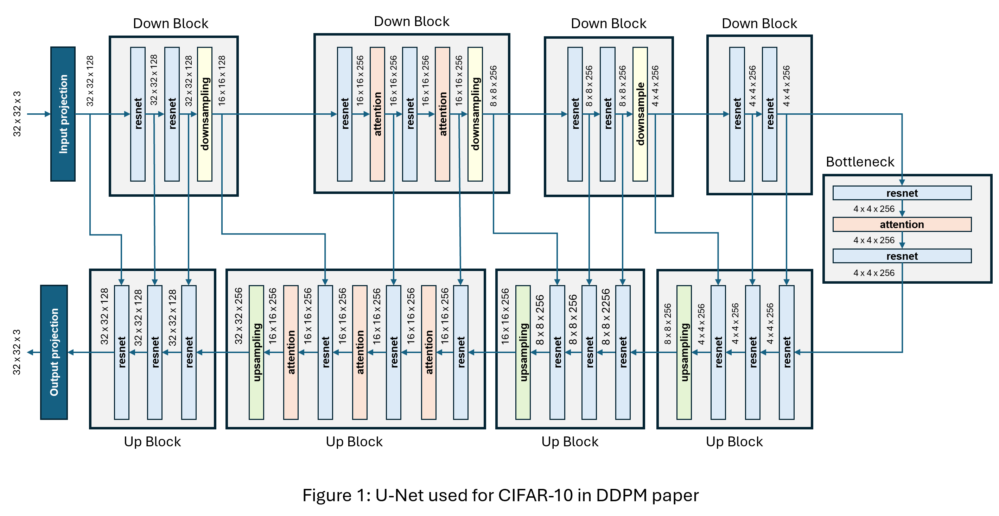
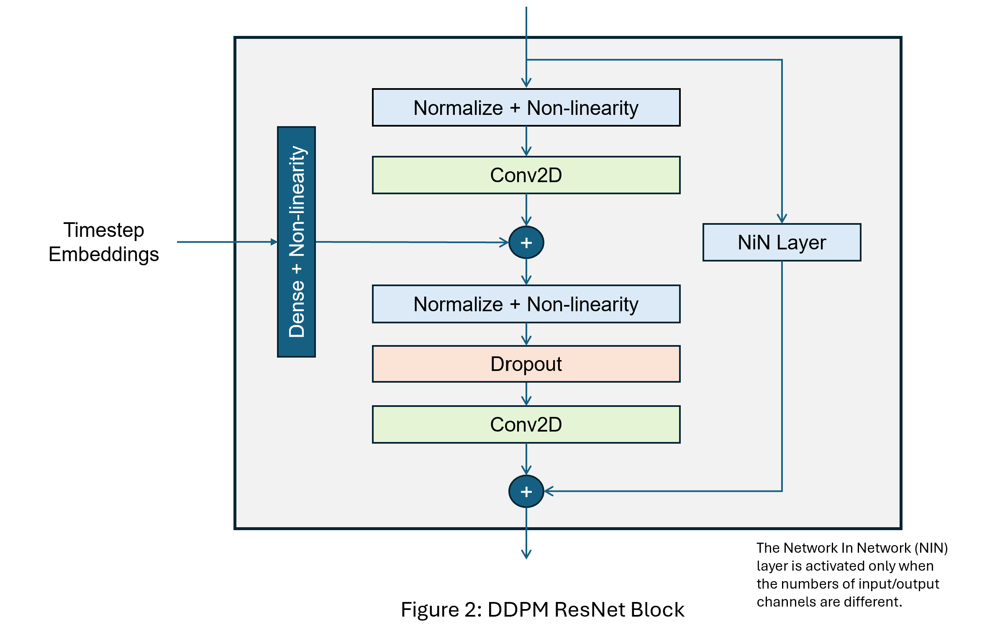
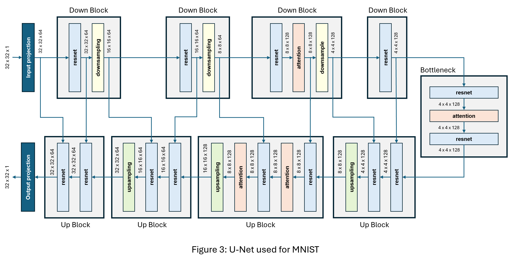
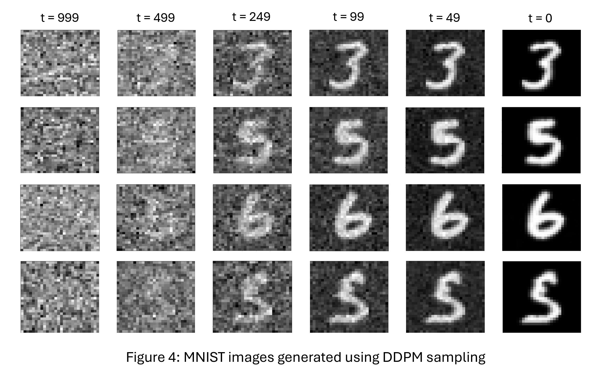
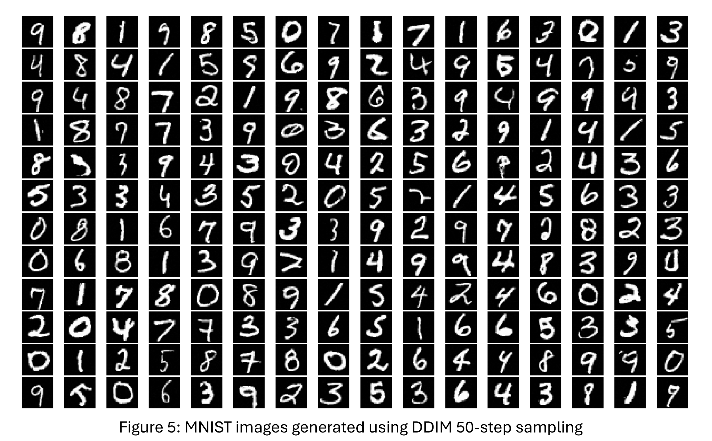
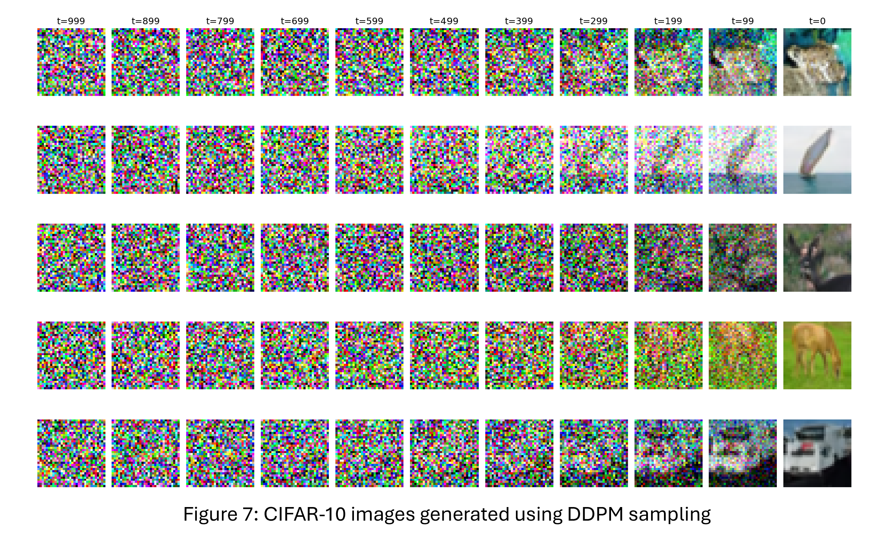
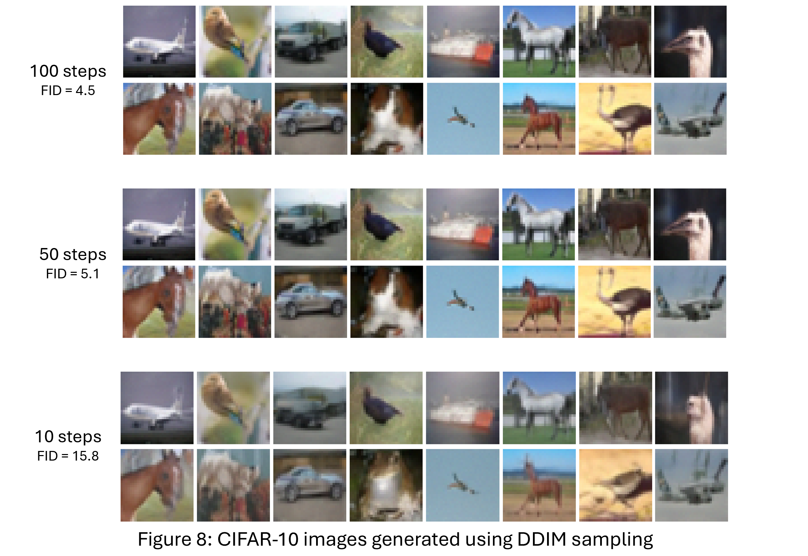

# Diffusion model from scratch using research papers

"What I cannot create, I do not understand."
— **Richard Feynman**

## 1. Background

Diffusion models have become the state-of-the-art approach for generating images, videos, and music. They power popular tools such as DALL-E, Stable Diffusion, Firefly, and Midjourney. They have also found applications in many other domains, including 3D modeling, medical imaging, drug discovery, molecular design, and more.

Model diffusion models were introduced in 2020 by Jonathan Ho et al. in their seminal paper titled "Denoising Diffusion Probabilistic Models" (DDPMs). It is now one of the most cited works in the field, with 10,000+ citations as of 2025.

Shortly after the DDPM paper came out, Jiaming Song et al. published "Denoising Diffusion Implicit Models" (DDIMs), which introduced a much faster sampling technique. Subsequent papers introduced various improvements that ultimately enabled diffusion models to produce higher-quality images than GANs, while being significantly easier to train.

## 2. Project goals

The goal of this project was to recreate the DDPM model from the 2020 paper by Jonathan Ho et al., train it, and generate samples using both the DDPM and DDIM methods.

Jonathan Ho posted on Github the TensorFlow code they used for their research, at this URL provided in the paper:

[JohnathanHo/DDPM](https://github.com/hojonathanho/diffusion)

Many PyTorch implementations of DDPM are now available on GitHub, including:

- [lucidrains/denoising-diffusion-pytorch](https://github.com/lucidrains/denoising-diffusion-pytorch?utm_source=chatgpt.com)

- [openai/improved-diffusion](https://github.com/openai/improved-diffusion?utm_source=chatgpt.com)

- [mattroz/diffusion-ddpm](https://github.com/mattroz/diffusion-ddpm?utm_source=chatgpt.com)

- [cloneofsimo/minDiffusion](https://github.com/cloneofsimo/minDiffusion?utm_source=chatgpt.com)

With so many PyTorch models around, I decided to write mine in TensorFlow.

I only relied on the 2020 DDPM and DDIM papers, and some of the works they reference. I only looked at Ho's code on GitHub when important U-Net implementation details were not specified in the paper.

I used MNIST as a pipe-cleaner to validate the U-Net architecture, training and sampling flows, and FID (Fréchet Inception Distance) calculation. Then, I trained a model on CIFAR-10 using the same U-Net as in the DDPM paper. I did not attempt to train models on the LSUN or CelebA-HD datasets due to GPU availability constraints.

## 3. Source code and Python packages

All the code for this project is in TensorFlow 2. Custom Keras layers and models are used for the U-Net and diffusion models.

The code is in the *./src* directory and is organized as shown below.

```
   src
    |     
    ├── u_net.py                   # U-Net model
    |
    ├── u_net_debug.py             # Same as u_net.py with prints and tensor shape assertions
    |
    ├── train_mnist.py             # Train diffusion model on MNIST dataset
    |
    ├── train_cifar10.py           # Train diffusion model on CIFAR-10 dataset
    |
    ├── mnist_fid.py               # Compute FID of generated MNIST images
    |
    ├── cifar10_fid.py             # Compute FID of generated CIFAR-10 images
    |
    ├── sample_and_display.py      # Generate images and display them
    |
    └── utils.py                   # Utilities and shared functions
```

See file *requirements.txt* for the list of Python packages I used.

## 4. Information missing in the DDPM paper

The DDPM paper describes in great detail the theory underlying DDPM models. It also provides training and sampling algorithms, which are straightforward to implement.

However, the information provided about the U-Net used to predict noise in the images is largely limited to the following paragraph:

```
B. Experimental details

Our neural network architecture follows the backbone of PixelCNN++ [52], which is a U-Net [48] 
based on a Wide ResNet [72]. We replaced weight normalization [49] with group normalization [66]
to make the implementation simpler. Our 32 x 32 models use four feature map resolutions 
(32 x 32 to 4 x 4), and our 256 x 256 models use six. All models have two convolutional residual
blocks per resolution level and self-attention blocks at the 16 x 16 resolution between 
the convolutional blocks [6]. Diffusion time t is specified by adding the Transformer sinusoidal
position embedding [60] into each residual block.
```

This description is not sufficient to fully reproduce the U-Net architecture used in the paper. Therefore, I had to reverse-engineer Ho's code on Github to obtain the missing implementation details.


## 5. U-Net model architecture

In Ho's code on Github, the U-Net used for the 32 x 32 images of the CIFAR-10 dataset is implemented as shown in Figure 1. The model has parameters to configure it for the 256 x 256 images of the CelebA and LSUN datasets.



The model follows the "classic" U-Net architecture:

- U-shaped architecture with a contracting path (encoder) and an expanding path (decoder)

- Skip connections that concatenate features from the contracting path to the corresponding layers in the expanding path, allowing the network to combine low-level and high-level features

Figure 2 shows the structure of the ResNet block as it is implemented in Ho's code.



The residual block was clearly inspired from Wide ResNet and PixelCNN++, as mentioned in the paper, and has the following key features:

- The residual connection adds the block’s input to its output after the block’s transformations. If the block input and output have the same number of channels, it is a straight connection. If they are different, a Network-in-Network (1 x 1 convolution) layer is inserted in the connection to make the shapes compatible for addition.

- Group normalization is done *before* convolution (pre-normalization).

- The timestep position embedding is passed through an MLP and added to the output of the first convolution. This allows the model to be aware of the current step in the diffusion process.

- Activations are SiLU (Swish) activations.

- A dropout layer is inserted between the normalization and convolution layers of the second sub-block.

Ho's code is in TensorFlow 1, which is now outdated. I did not try to run it. Instead, I wrote a state-of-the-art TensorFlow 2 model from scratch, using custom Keras layers (*u-net.py*). I also created a version of the model that prints tensor shapes and includes assertions to check them (*u_net_debug.py*), which was quite useful to debug my model and make sure it aligned with Ho's code.

In appendix *B. Experimental Details*, the authors mention:
```
Our CIFAR-10 model has 35.7 million parameters, and our LSUN and CelebA-HQ models have 114 million
parameters. We also trained a larger variant of the LSUN Bedroom model with approximately 
256 million parameters by increasing filter count.
```

In the CIFAR-10 configuration (Figure 1), my U-Net model has 35.9M parameters. I was not able to explain the discrepancy with the 35.7M number given in the paper.

## 6. MNIST diffusion model

### 6.1 U-Net

The U-Net I used for the MNIST dataset is shown in Figure 3. It is a scaled-down version of the U-Net the authors of the DDPM paper used for the CIFAR-10 dataset, which significantly reduces runtimes.



This model has 4.9M parameters, which is much smaller than Ho's CIFAR-10 model with its 35.9M parameters.

I made the following changes to the U-Net architecture used for CIFAR-10 in the DDPM paper:

- Input images padded from 28 x 28 to 32 x 32 to enable 4 resolution sizes
- Number of base channels (channels that the input convolution outputs) reduced from 128 to 64
- Only 1 ResNet block per up/down stage instead of 2
- Attention at the 8 x 8 resolution instead of 16 x 16
- Output images cropped from 32 x 32 to the original 28 x 28 size

### 6.2 Training setup

I used the training setup the authors of the DDPM paper described in "*Appendix B: Experimental details*":

- Timesteps: 1000
- EMA decay factor: 0.9999
- Dropout rate: 0.1
- Optimizer: Adam with learning rate 2e-4
- Batch size: 128

The authors used a linear variance schedule. Instead, I used the cosine variance schedule introduced by Nichol & Dhariwal in 2021. This type of schedule was shown to improve results in many settings as it avoids destroying image information too quickly at the beginning of the forward process, as observed with linear schedules.

### 6.3 Sampling

Examples of samples obtained with the DDPM sampling method are shown in Figure 4. The images are shown at different timesteps of the reverse process.



Examples of samples obtained using the DDIM sampling method are shown in Figure 5. Only 50 steps were used to obtain these images, using a completely deterministic method.




### 6.4 FID results

To compute the FID, I generated 60,000 images using DDIM sampling, and used the MNIST 60,000 training images as the reference distribution.

completely deterministic (eta=0).

The results obtained are shown in the table below:

|  Training epochs  |  DDIM steps |   FID   |
|-------------------|-------------|---------|
|       100         |        50   |   43.6  |
|       200         |        50   |   39.3  |
|       300         |        50   |   38.2  |
|       500         |        50   |   39.8  |
|       500         |       100   |   37.7  |
|       650         |       100   |   37.8  |

These are not good results, but they are clearly a result of the small U-Net size. As mentioned above, I used MNIST as a pipe-cleaner and did not attempt to get SOTA results.

A couple of things to note:

- The best FID score is obtained around 300 training epochs (although the loss keeps decreasing with additional epochs).
- The FID score gets better when increasing the DDIM number of samples from 50 to 100.

## 7. CIFAR-10 diffusion model

### 7.1 U-Net

For my CIFAR-10 diffusion model, I used the same U-Net as in Ho's code (Figure 1).

### 7.2 Training setup

The training setup is described in appendix B "Experimental results" of the DDPM paper.
This is the setup I used for MNIST. Like in the DDPM paper, I used random horizontal flips to increase image diversity.

### 7.3 Sampling

Figure 6 shows examples of images obtained using the DDPM sampling method.



Figure 7 shows some image samples obtained using the DDIM sampling method. Examples of generative hallucinations are shown on the last row of images:

- A cat with a red mouse on top of its head
- An entirely red dog lying on the ground
- A pink cat
- A deer with front legs shaped like horns




### 7.4 FID results

Like in the DDPM paper, I used the 50,000 CIFAR-10 training images as the reference distribution and generated the same number of samples using DDIM sampling to compute FID scores.

The DDPM authors trained for 800k optimization steps (batch size 128, ~2,000 epochs) and reported an FID of 3.17 using 1,000-step DDPM sampling.

My implementation differs in two ways that preclude direct comparison: I use a cosine variance schedule instead of linear, and DDIM instead of DDPM sampling.

The results I obtained with my model are summarized in the table below.

|  Training epochs  |  DDIM steps   |      FID       |
|-------------------|---------------|----------------|
|        150        |      100      |      11.3      |
|        400        |      100      |       7.73     |
|        500        |      100      |       6.72     |
|        600        |      100      |       6.97     |
|        700        |      100      |       7.01     |
|        900        |      100      |       7.14     |
|       1000        |      50       |       8.96     |
|       1000        |      100      |       7.24     |
|       1000        |      200      |       5.71     |
|       2000        |      100      |       7.73     |


The FID score reaches its minimum after approximately 500 epochs, corresponding to about 195k optimization steps. Beyond this point, image quality gradually deteriorates, even though the training loss continues to decrease. This behavior may originate from the replacement of the linear schedule by a cosine schedule, given that Ho et al. explicitly optimized their U-Net, hyperparameters and training setup for a linear schedule. But further experiments would be required to confirm it.

Increasing the number of DDIM sampling steps significantly improves sample quality, as observed with the model trained for 1,000 epochs. This behavior is expected, since a larger number of reverse diffusion steps provides a more accurate approximation of the underlying generative process.

I did not evaluate DDPM sampling because of its substantially higher computational cost. Since the original DDPM algorithm uses 1,000 denoising steps, sampling is approximately 10x slower than DDIM sampling with 100 steps and 5x slower with 200 steps, as the computational cost is dominated by the number of forward passes through the model.

## 8. Conclusion

Recreating the diffusion model from the landmark DDPM paper by Jonathan Ho et al. proved an excellent exercise in bridging the gap between the theoretical generative equations and the intricacies of the U-Net architecture, training and evaluation procedures, and interpretation of results.

With 1,000 training epochs and 200 DDIM sampling steps, the implemented model achieves an FID score of 5.71, with a 5x computational advantage compared to 1,000-step sampling. Although the FID score is not as good as the 3.17 score Ho et al. reported, it is a solid result. 

Additional experiments would be required to investigate the reasons why replacing the linear variance schedule Ho et al. used by a cosine schedule did not yield any improvement. Tuning hyperparameters and training setup for the cosine schedule might deliver on expectations.

It was absolutely fascinating to observe images progressively emerging from noise during the reverse process!
